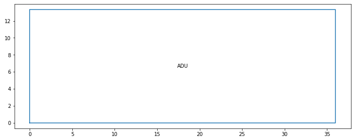

# What is reBuildingCode?

What if houses, rooms, and doors could be represented as data objects? We
could program these objects to interact the same way they do in the real
world. Then, we could automate the design process so that these objects are
procedurally generated and self-optimized to maximize cost-efficiency,
sustainability, and quality of life.

reBuildingCode (RBC) is a project set out to do just that by applying
tried-and-true [object-oriented programming](./oop.md) methods to
architectural and construction concepts.

## Let's build a floor plan for an ADU


Image source: https://www.macyhomes.com/adu_floor_plans

### Creating the floor plan

We can define the rectangular space by defining four points. `Point`s are
defined by `(x, y, z)` coordinates.

```python
# adu points
a1 = Point(0, 0, 0)
a2 = Point(0, 13.333, 0)
a3 = Point(36, 13.333, 0)
a4 = Point(36, 0, 0)
```

We can create the `FloorPlan` like so:

```python
adu = FloorPlan(name='ADU', points=[a1, a2, a3, a4])
```

We can check the area of the ADU by checking the `.area` attribute.

```python
>>> adu.area
479.988
```

We can check our layout by running the `.plot()` method.

```python
adu.plot()
```



This looks pretty good. However, it's missing the additional details like the
rooms.

### Creating the master bedroom

We can define the space of a rectangular room by defining four points. Points
are defined by `(x, y, z)` coordinates.

```python
mb1 = Point(0, 0, 0)
mb2 = Point(0, 13.333, 0)
mb3 = Point(9.333, 13.333, 0)
mb4 = Point(9.333, 0, 0)
```

We can use these four points to define the master bedroom.

```python
master_bedroom = Room(room_type='bedroom', name='Master Bedroom',
                      points=[mb1, mb2, mb3, mb4])
master_bedroom.plot()
```


Now let's add the master_bedroom to the ADU's `FloorPlan`.

```python
adu.add_room(master_bedroom)
```

Let's check our progress by plotting our ADU again.

```python
adu.plot()
```


### Creating the bathroom and kitchen

```python
# bathroom points
b1 = Point(0, 0, 0)
b2 = Point(0, 9.833, 0)
b3 = Point(7.917, 9.833, 0)
b4 = Point(7.917, 0, 0)

bathroom = Room(room_type='bathroom', name='Bathroom', points=[b1, b2, b3, b4])

# kitchen points
k1 = Point(0, 0, 0)
k2 = Point(0, 13.333, 0)
k3 = Point(11, 13.333, 0)
k4 = Point(11, 0, 0)

kitchen = Room(room_type='kitchen', name='Kitchen', points=[k1, k2, k3, k4])
```

Let's add these two rooms to the `FloorPlan`.

```python
adu.add_room(bathroom, x_offset=9.333)
adu.plot()
```


```python
adu.add_room(kitchen, x_offset=17.25)
adu.plot()
```


Great! We now have an accurate visual of the floor plan. Because each
component is a data object, we can easily get a summary of information about
our floor plan.

```python
>>> adu.room_count()
Counter({'bedroom': 1, 'bathroom': 1, 'kitchen': 1})
```

```python
>>> adu.plan_summary()  # return the area of each room type
{
    'bedroom': 124.43688900000001,
    'bathroom': 77.847861,
    'kitchen': 146.663
}
```

### Procedurally-generate floor plans

Another advantage of working with data objects is that it's easy to transition
to an automated workflow where our floor plans are procedurally generated.

```python
pg_adu = FloorPlan(rooms=[master_bedroom, kitchen, bathroom],
                   name='Procedurally Generated ADU',
                   points=adu_points)
```


By adding more rules, we can improve this process so that the designs are
optimized for cost or quality of life. There will be even more possibilities
with machine learning and AI!

Hopefully, it was really easy to understand the code above. If you think
programming will improve your current workflow, I invite you to get involved
and contribute to this library. Please see our docs on contributing.